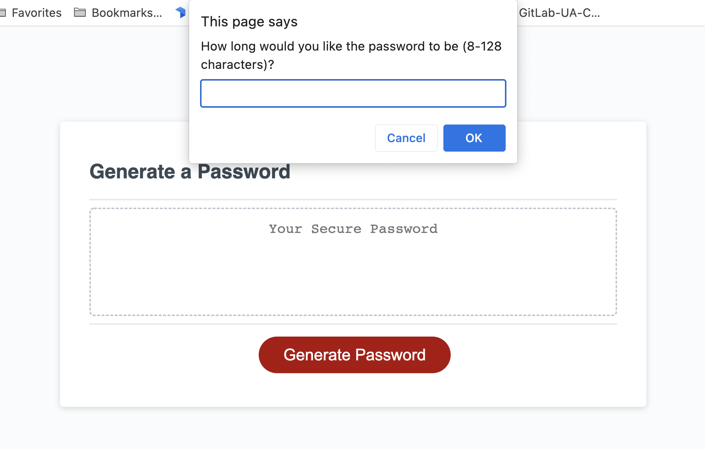

# Password Generator

## Website Description
The website is a password generator which can take user selections of whether they would like to include numbers, symbols, lowercase or uppercase letters in a 8-128 character password. The password appears in the central box on the screen after selected input is included. 

## Challenge Description
After being given starter code with an HTML and CSS webpage, JavaScript is added to add functionality to the password generator. After pressing the initial generate button, multiple prompts/alerts/and confirms are popped up onto the user's screen to ask them character length (8-128 characters), and whether they want numbers, symbols, and upper or lowercase letters. The user is instructed to select at least one character style if none are selected. The password then appears in the box. This is done using mulitple functions, arrays, and if/else statements in the JavaScript file. 

## User Story

```
AS AN employee with access to sensitive data
I WANT to randomly generate a password that meets certain criteria
SO THAT I can create a strong password that provides greater security
```

## Acceptance Criteria

```
GIVEN I need a new, secure password
WHEN I click the button to generate a password
THEN I am presented with a series of prompts for password criteria
WHEN prompted for password criteria
THEN I select which criteria to include in the password
WHEN prompted for the length of the password
THEN I choose a length of at least 8 characters and no more than 128 characters
WHEN asked for character types to include in the password
THEN I confirm whether or not to include lowercase, uppercase, numeric, and/or special characters
WHEN I answer each prompt
THEN my input should be validated and at least one character type should be selected
WHEN all prompts are answered
THEN a password is generated that matches the selected criteria
WHEN the password is generated
THEN the password is either displayed in an alert or written to the page
```

## Tasks Completed
The starter code HTML document includes:
* a proper title
* proper HTML semantic labelling
* a header, titled box with placeholder text for the password, and generate password button
* comments

The starter code CSS document includes:
* universal, elemental, class, and id selectors
* stylization for the header, main box, and inner text output box
* media-queries for various screen sizes

The JavaScript document includes:
* universal variables
* "click" event listener
* writePassword function which includes character length input and generatePassword function
* generatePassword function which includes confirmation pop-ups for each character type 
* getRandomPassword function which selects how many characters should be used based on user input of 8-128
* getRandomCharacter function which adds each type of character to an array if the user chooses that character type
* functions for outputting random characters from each type (numbers, symbols, upper & lowercase letters)

## Languages
- HTML
- CSS
- JavaScript

## Links
* [Deployed webpage](https://villettec.github.io/M3C-Password_Generator/)

* [Repository](https://github.com/villettec/M3C-Password_Generator/)

## Screenshot


## Credit
Villette Comfort

villette@live.com
